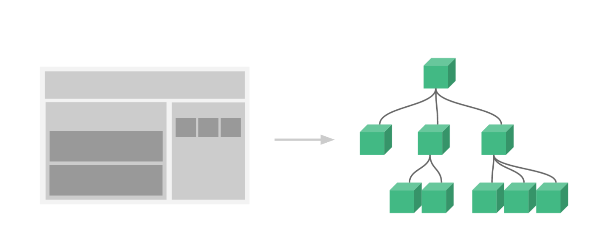

# VuejsEsercizi

Studio della documentazione ufficiale della libreria/framework VueJs

### COMPONENTI

#### Importante: nei componenti i dati sono una funzione.

```
// Define a new component called button-counter
Vue.component('button-counter', {
  data: function () {
    return {
      count: 0
    }
  },
  template: '<button v-on:click="count++">You clicked me {{ count }} times.</button>'
})
```

```
<div id="components-demo">
  <button-counter></button-counter>
</div>
```

```
new Vue({ el: '#components-demo' })
```

I componenti sono degli oggetti riutilizzabili

```
<div id="components-demo">
  <button-counter></button-counter>
  <button-counter></button-counter>
  <button-counter></button-counter>
</div>
```

#### Albero dei componenti

c'è un componente root e poi a cascata tutti i componenti innestasti.



#### Props

Per passare i dati ad un componete come degli attibuti si usano le props,
vedi esempio sotto.

##### Registriamo un componente post

```
Vue.component("blog-post", {
  props: ["title"],
  template: "<h5>{{ title.titolo  + ': '+title.descrizione }}</h5>",
});
```

questo componente prende in input un oggetto attraverso la prop: title.

##### registriamo l'app root che contiene anche i dati oltre che un riferimento al div "elencoPost".

```
new Vue({
  el: "#elencoPost",
  data: {
    nomepagina: "Elenco post",
    elencoPost: [
      { id: 101, titolo: "Apple", descrizione: "questo post parla di Apple" },
      { id: 102, titolo: "Google", descrizione: "questo post parla di Google" },
      { id: 103, titolo: "Amazon", descrizione: "questo post parla di Amazon" },
    ],
  },
});
```

##### Alleghiamo al div root elencoPost il componente blog-post tante volte quanti sono gli elementi dell'array di data.elencopost, ciclicamente valorizziamo la prop.

```
  <div id="elencoPost" class="demo">
      <h2>{{nomepagina}}</h2>
      <blog-post
        v-for="post in elencoPost"
        v-bind:key="post.id"
        v-bind:title="post"
      >
      </blog-post>
    </div>
```

##### $emit creazione eventi che posso essere ascoltari dal parent

Grazie al comanto $emit è possibile generare eventi sul componente
figlio e propagarli verso il padre.

```
<button v-on:click="$emit('enlarge-text', 0.1)">
  Enlarge text
</button>
```

```
<blog-post
  ...
  v-on:enlarge-text="postFontSize += $event"
></blog-post>

```

oppure se l'event handler è un metodo scrivere così

```
<blog-post
  ...
  v-on:enlarge-text="onEnlargeText"
></blog-post>
```

### v-on oppure @ (Gesitone Eventi)

```
<div id="example-1">
  <button v-on:click="counter += 1">Add 1</button>
  <p>The button above has been clicked {{ counter }} times.</p>
</div>

```

```
var example1 = new Vue({
  el: '#example-1',
  data: {
    counter: 0
  }
})
```

#### Event Modifiers

- stop
- prevent
- capture
- self
- once
- passive

#### Key Modifiers

```
<!-- only call `vm.submit()` when the `key` is `Enter` -->
<input v-on:keyup.enter="submit">
```

- enter
- tab
- delete (captures both “Delete” and “Backspace” keys)
- esc
- space
- up
- down
- left
- right

Per maggiori info https://vuejs.org/v2/guide/events.html

### Array Change Detection

ue wraps an observed array’s mutation methods so they will also trigger view updates. The wrapped methods are:

- push()
- pop()
- shift()
- unshift()
- splice()
- sort()
- reverse()

### CREARE un'istanza versione vue js 2

```
var vm = new Vue({
  // options
})

```

```
// Our data object
var data = { a: 1 }

// The object is added to a Vue instance
var vm = new Vue({
  data: data
})

// Getting the property on the instance
// returns the one from the original data
vm.a == data.a // => true

// Setting the property on the instance
// also affects the original data
vm.a = 2
data.a // => 2

// ... and vice-versa
data.a = 3
vm.a // => 3

```

### v-once

questa direttiva assicura il data-binding sono una volta e poi non modifica più l'elemento.
esempio:

`<span v-once>This will never change: {{ msg }}</span>`

### v-html

permette di inserire codice html a differenza delle doppie parentesi graffe {{}} che vendono interpretate come testo.

```
<p> Using mustaches: {{ rawHtml }}</p>


<p>Using v-html directive: <span v-html="rawHtml"></span></p>

```

### v-bind oppure scrivere solo :

la direttiva v-bind viene usata per modificare dinamicamente gli attributi degli elementi html.

`<div v-bind:id="dynamicId"></div> `

è uguale à

`<div :id="dynamicId"></div> `

### {{ }}

nelle doppie parentesi graffe è possibile inserire anche dei comandi javascript.

```
<!-- this is a statement, not an expression: -->
{{ var a = 1 }}

<!-- flow control won't work either, use ternary expressions -->
{{ if (ok) { return message } }}
```

### v-if

esempio

`<p v-if="seen">Now you see me</p> `

```
<template v-if="ok">
  <h1>Title</h1>
  <p>Paragraph 1</p>
  <p>Paragraph 2</p>
</template>

```

### v-else

```
<div v-if="Math.random() > 0.5">
  Now you see me
</div>
<div v-else>
  Now you don't
</div>
```

### v-else-if

```
<div v-if="type === 'A'">
  A
</div>
<div v-else-if="type === 'B'">
  B
</div>
<div v-else-if="type === 'C'">
  C
</div>
<div v-else>
  Not A/B/C
</div>
```

### v-show

La direttiva v-show lavora allo stemmo modo di v-if ma c'è una differenza a livello browser:
v-if nasconde l'elemento mentre v-show lo distrugge ed eventualmente lo ricrea.

######

v-show non ha else

v-show non funziona con i template.

### Perticolri usi delle direttive

`<a v-bind:[attributeName]="url"> ... </a>` parametro variabile

`<< v-on:[eventName]="doSomething"> ... </>` parametro variabile

`<form v-on:submit.prevent="onSubmit"> ... </>` event.preventDefault()

### v-on si può scrivere anche con @

`<a v-on:click="doSomething"> ... </a>`

è uguale a

`<a @click="doSomething"> ... </a> `

### Le computed

Sono opzioni del componente simili alle funzioni (methods) ma a differenza dei metodi
non vengono eseguite se il valore non cambia perchè sono salvate nella cache. Sono molto utili nei casi in cui bisogna risparmiare computazioni. es: se dobbiamo scaricare un elenco pesante per una lista, possiamo decidere di associarlo ad una compiuted così l'operazione viene eseguita solo una vole.

```
<div id="computed-basics">
  <p>Has published books:</p>
  <span>{{ publishedBooksMessage }}</span>
</div>
```

```
Vue.createApp({
  data() {
    return {
      author: {
        name: 'John Doe',
        books: [
          'Vue 2 - Advanced Guide',
          'Vue 3 - Basic Guide',
          'Vue 4 - The Mystery'
        ]
      }
    }
  },
  computed: {
    // a computed getter
    publishedBooksMessage() {
      // `this` points to the vm instance
      return this.author.books.length > 0 ? 'Yes' : 'No'
    }
  }
}).mount('#computed-basics')
```

### v-for

```
<ul id="example-1">
  <li v-for="item in items" :key="item.message">
    {{ item.message }}
  </li>
</ul>

```

```
var example1 = new Vue({
  el: '#example-1',
  data: {
    items: [
      { message: 'Foo' },
      { message: 'Bar' }
    ]
  }
})
```
